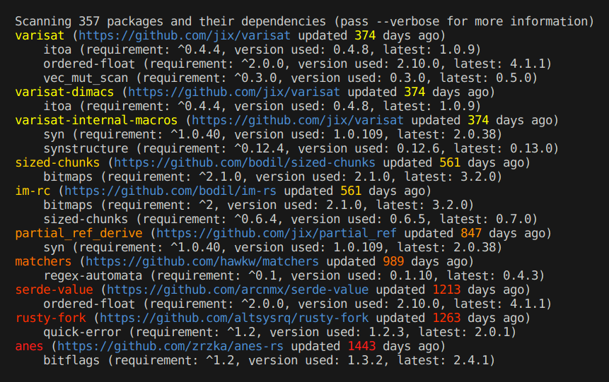

# cargo-unmaintained

**Find unmaintained packages in Rust projects**

`cargo-unmaintained` is similar to [`cargo-audit`]. However, `cargo-unmaintained` finds unmaintained packages automatically using heuristics, rather than rely on users to manually submit them to the [RustSec Advisory Database].

`cargo-unmaintained` defines an unmaintained package X as one that satisfies one of 1 through 3 below:

1. X's repository is archived (see [Notes] below).

2. X is not a member of its named repository.

3. Both a and b below.

   a. X depends on a version of a package Y that is incompatible with the Y's latest version.

   b. Either X has no associated repository, or its repository's last commit was over a year ago (a configurable value).

As of 2024-04-14, the RustSec Advisory Database contains 97 active advisories for unmaintained packages. Using the above conditions, `cargo-unmaintained` automatically identifies 69 of them (more than two thirds). These results can be reproduced by running the [`rustsec_advisories`] binary within this repository.

### Notes

- To check whether packages' repositories have been archived, set the `GITHUB_TOKEN_PATH` environment variable to the path of a file containing a [personal access token]. If unset, this check will be skipped.

- The above conditions consider a "leaf" package (i.e., a package with no dependencies) unmaintained only if conditions 1 or 2 apply.

- The purpose of condition 3(b) is to give package maintainers a chance to update their packages. That is, an incompatible upgrade to one of X's dependencies could require time-consuming changes to X. Without this check, `cargo-unmaintained` would produce many false positives.

- Of the 28 packages in the RustSec Advisory Database _not_ identified by `cargo-unmaintained`:
  - 8 do not build
  - 3 are existent, unarchived leaves
  - 2 were updated within the past 365 days
  - 15 were not identified for other reasons

## Output

`cargo-unmaintained`'s output includes the number of days since a package's repository was last updated, along with the dependencies that cause the package to be considered unmaintained.

For example, the following is the output produced by running `cargo-unmaintained` on [Cargo 0.74.0] on 2023-11-11:

<!--
`Scanning 357 packages and their dependencies (pass --verbose for more information)`
-->



## Installation

```sh
cargo install cargo-unmaintained
```

## Usage

```
Usage: cargo unmaintained [OPTIONS]

Options:
      --color <WHEN>    When to use color: always, auto, or never [default: auto]
      --fail-fast       Exit as soon as an unmaintained package is found
      --max-age <DAYS>  Age in days that a repository's last commit must not exceed for the
                        repository to be considered current; 0 effectively disables this check,
                        though ages are still reported [default: 365]
      --no-cache        Do not save cloned repositories on disk for future runs
      --no-exit-code    Do not set exit status when unmaintained packages are found
      --no-warnings     Do not show warnings
  -p, --package <NAME>  Check only whether package NAME is unmaintained
      --tree            Show paths to unmaintained packages
      --verbose         Show information about what cargo-unmaintained is doing
  -h, --help            Print help
  -V, --version         Print version

The `GITHUB_TOKEN_PATH` environment variable can be set to the path of a file containing a personal
access token. If set, cargo-unmaintained will use this token to authenticate to GitHub and check
whether packages' repositories have been archived.

Unless --no-exit-code is passed, the exit status is 0 if no unmaintained packages were found and no
irrecoverable errors occurred, 1 if unmaintained packages were found, and 2 if an irrecoverable
error occurred.
```

## Ignoring packages

If a workspace's `Cargo.toml` file includes a `workspace.metadata.unmaintained.ignore` array, all packages named therein will be ignored. Example:

```toml
[workspace.metadata.unmaintained]
ignore = ["matchers"]
```

## Testing

Some tests are not run by default because they are "externally influenced," i.e., they rely on data from external sources. To enable these additional tests, enable feature `ei`, e.g.:

```sh
cargo test --features=ei
```

## Known problems

**Repositories whose urls change across versions may be incorrectly reported as unmaintained.** `cargo-unmaintained` treats the metadata of the latest version of a package referred to by a project as "ground truth." However, this can cause false positives. For example, if the latest version of [`regex-automata`] that your project relies on is [0.2.0], `cargo-unmaintained` will report the package is unmaintained, though it is not.

## License

`cargo-unmaintained` is licensed and distributed under the AGPLv3 license. [Contact us](mailto:opensource@trailofbits.com) if you're looking for an exception to the terms.

[0.2.0]: https://docs.rs/crate/regex-automata/0.2.0/source/Cargo.toml
[Cargo 0.74.0]: https://github.com/rust-lang/cargo/tree/d252bce6553c8cc521840c9dd6b9f6cd4aedd8b0
[Notes]: #notes
[RustSec Advisory Database]: https://github.com/RustSec/advisory-db/
[`cargo-audit`]: https://github.com/RustSec/rustsec/tree/main/cargo-audit
[`regex-automata`]: https://crates.io/crates/regex-automata
[`rustsec_advisories`]: ./rustsec_util/src/bin/rustsec_advisories.rs
[personal access token]: https://docs.github.com/en/authentication/keeping-your-account-and-data-secure/managing-your-personal-access-tokens
